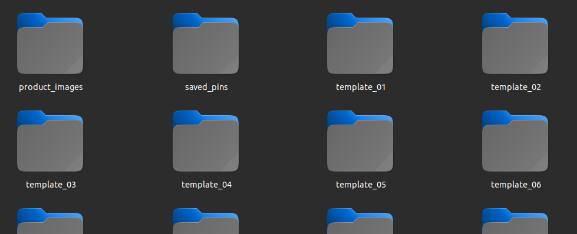
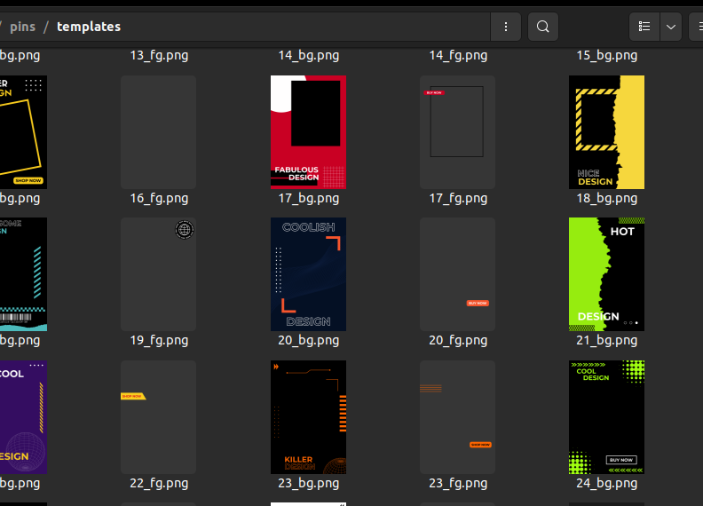
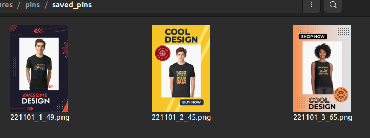
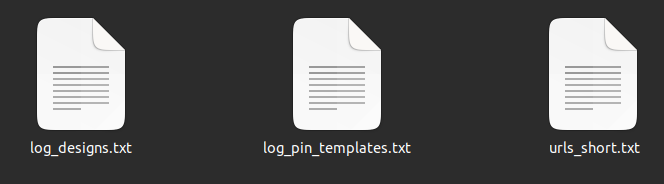

# Pinterest Pin Generator

 __Contents__

  * [Description](#description)
  * [Built with](#built-with)
  * [Installation & Usage](#installation-&-usage)
  * [Contact](#contact)

&nbsp;

##Description

I had the idea for this project as an attempt to automate the task of generating pins for Pinterest to promote my online t-shirt store. Initially I created many (nearly 80) pin templates in svg (vector) format. But using them to create 5 daily pins with a vector image editor proved to be a very monotonic task. So I decided to  use Python to manipulate my pin templates and create at once as many pins as I wanted.

I briefly describe the image folders and files the script uses. There is one generic _pins_ folder containing several subfolders: a _product_images_ folder, with all the pictures I want to promote in Pinterest; a _saved_pins_ folder, where the generated pins are saved.



The _templates_ folder contains all the pin templates I created. Each pin template is composed of two image files (a _nn_bg.png_ and a _nn_fg.png_), needed to generate one specific pin model.



To generate one pin, the script randomly chooses an image file from the _product_images_ folder (let's call it _pd.png_), as well as _nn_bg.png_ and _nn_fg.png_ files from the templates folder. It then pastes all three of them together, one onto the other, to form one single image, which is the final pin. The pin is then saved in the _saved_pins_ folder.

To generate  _n_ pins, the script randomly chooses _n_ images from the _product_image_ folder and _n_ pin templates from the _templates_ folder, and uses them to generate _n_ pins.




For each generated pin, the product image file name and template number are written in _log_designs.txt_ and a _log_pin_templates.txt_ files, respectively, so that the script excludes them when generating the next set of pins, avoiding repetition. A previously used pin is eligible for publication again if it's not included in the last 36 generated pins from previous executions.



There are four modules: _create_pins.py_, the main module; _templates.py_, containig all the functions needed to generate the pins; _info.py_, where there are functions needed to generate the pins' filenames, write them in the log files as well as the mechanism to temporarily keep previously used pins from being selected again too soon; and _config.py_, the configuration module, containing constants needed in the script, such as the general path to the _pins_ superfolder, the number of pins generated by default, etc.

Finally, the script also generates a text file, _pin_info_to_publish.txt_, containing information about each generated pin that is useful for publication, such as numbering, the product image design name and the shortened url to be added to pin in Pinterest (previously stored in another file, called _urls_short.txt_).
<br><br>

##Built With

This script is written entirely with Python 3.10, and uses the libraries _PIL/PILLOW_ for image manipulation, _datetime_, _random_, _sys_ and _os_.
<br><br>

##Installation & Usage

To run this script, just place all four modules (_create_pins.py, templates.py, info.py_ and _config.py_) and the text files (_log_designs.txt_, _log_pin_templates.txt_ and _urls_short.txt_) in the same folder, and then execute the main file _create_pins.py_:

```shell
$ python create_pins.py
```
If the variable _DEFAULT_NUMBER_OF_PINS_ in the _config.py_ module is set to 3, for example, then when the pins are created and saved you will get a message:
```shell
$ Successfully created 3 pins
```
You will find 3 brand new pins in the _saved_pins_ folder. To generate an arbitrary number _n_ of pins, just add it as a parameter:
```shell
$ python create_pins.py n
```
You can also get a _'help'_ file if you type _help_ as a parameter:
```shell
$ python create_pins.py help
```
You will then get:
```shell
Help file
This file creates random pins. It runs with zero or one parameter:

   python create_pins.py          -> creates the default number of pins
   python create_pins.py <numb>   -> creates <numb> pins
   python create_pins.py help     -> shows this help file

Newly created pins will appear in the saved_pins folder.
```
<br>

##Contact

Please feel free to contact me any time for any questions you may have:

_agustin.pena.tutor@gmail.com_
&nbsp;

Thanks for stopping by! 😄
