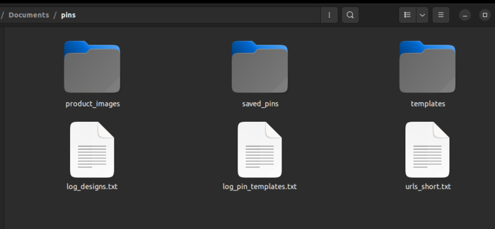

# Pinterest Pin Generator Script

<details>
  <summary>Contents</summary>

  1. Description
  2. Built with
  3. Installation & Usage
  4. Contact
</details>
&nbsp;  


**Description**

I had the idea for this project as an attempt to automate the task of generating pins for Pinterest to promote my online t-shirt store. Initially I created many (nearly 80) pin templates in svg (vector) format. But using them to create 5 daily pins with a vector image editor proved to be a very monotonic task. So I decided to  use Python to manipulate my pin templates, so that I could create at once as many pins as I wanted.

I briefly describe the image files and folders the script uses. There is one generic folder containing several subfolders: a _product_images_ folder, with all the pictures I want to promote in Pinterest; a _saved_pins_ folder, where the generated pins are saved; 



It also contains several _template_nn_ folders, containing each a _bg.png_ image file and a _fg.png_ image file, needed to generate one specific pin model.


To generate one pin, the script takes a (let's call it _pd.png_) image file from the _product_images_ folder, as well as  _bg.png_ and _fg.png_ files (the latter has transparent background) from a template folder. It then pastes all three of them together, one onto the other, to form one single one, which is the final pin. The pin is then saved in the _saved_pins_ folder.

To generate  _n_ pins, the script randomly chooses _n_ images from the _product_image_ folder and _n_ pin template folders, and uses them to generate _n_ pins.


The product image file name and template numbers are written in a _log.txt_ and a _registry.txt_ respectively, so that the script excludes them when generating the next set of pins, avoiding repetition. After eight executions of the script, a previously used template can be chosen again.


&nbsp;  

__Built With__

This script is made entirely with Python 3.10 and the libraries: _PIL/PILLOW_, for image manipulation, and standard libraries _datetime_, _random_ and _os_.
&nbsp;

__Instalation & Usage__

To run this script, just place all three files (_createpins.py, templaes.py, info.py_) in the same folder and then execute the main file _createpins.py_:

```console
$ python createpins.py
```
if the script is set internally to generate _n=3_ pins, then when the pins are created and saved, you will get a message:
```console
$ Successfully created 3 pins
```
You will find three brand new pins in the _saved_pins_ folder.
&nbsp;  

__Contact__

Please feel free to contact me any time for any questions you may have:  
&nbsp;  
_agustin.pena.tutor@gmail.com_
&nbsp;   

Keep in touch!
